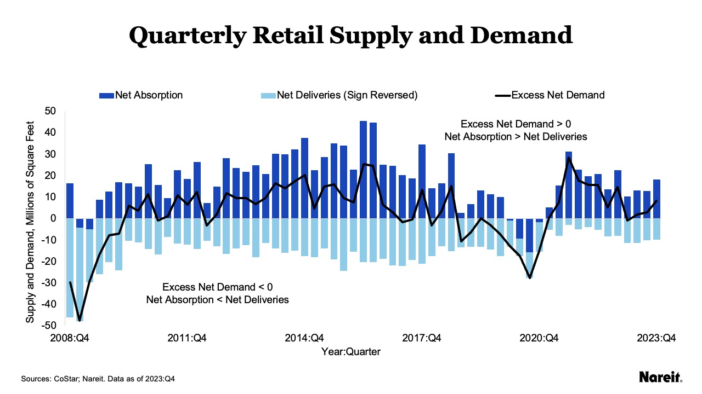
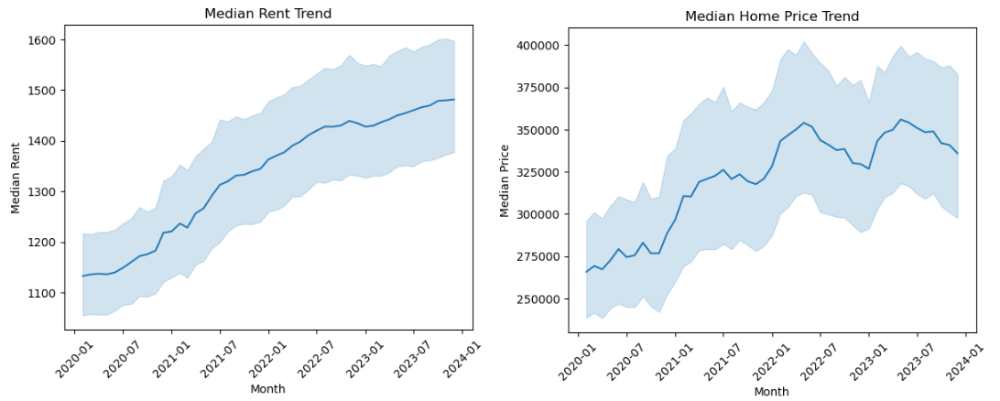
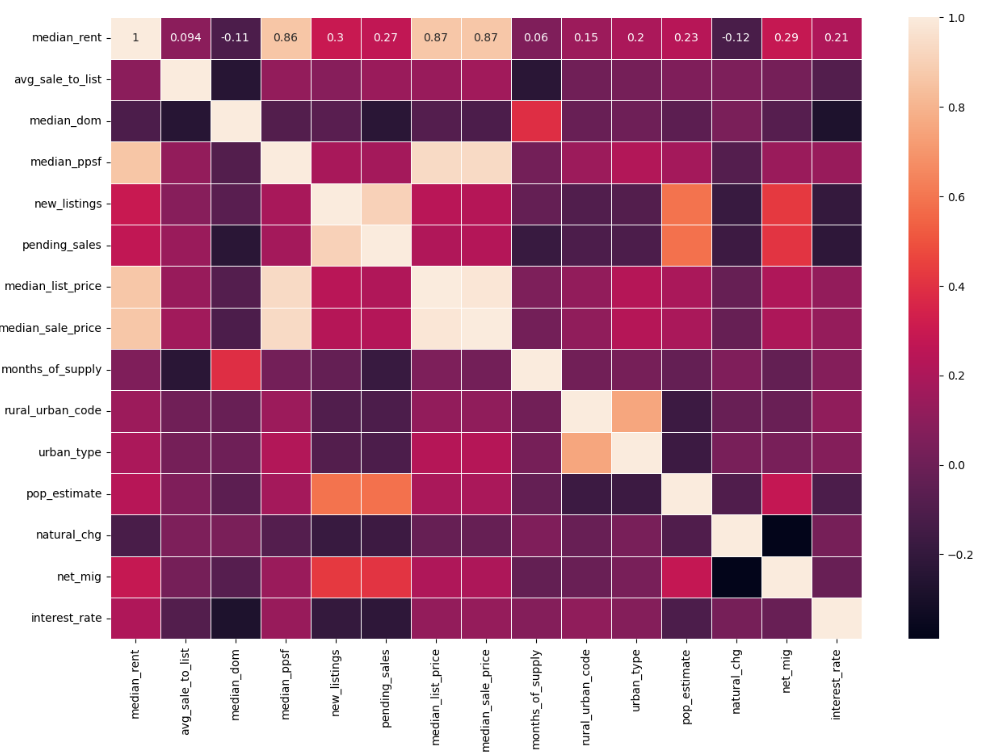
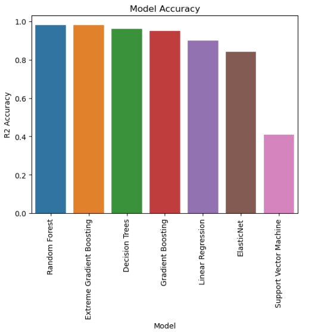

# Business Understanding

Rental properties are a very popular and lucrative investment for many individual investors who have disposable income and want to diversify their portfolio and reduce risk from stock market trends. For many, real estatement investments can also generate long term secondary income that can supplement their normal income as they get closer to retirement. There two most common ways to invest in rental properties are short term rentals or long term rentals. Short term rentals tend to require active management and oversight and would not be a good fit for those looking for passive investments. Long term rentals on the other hand present a great opportunity with very little involvement. Given the prolonged supply shortage in housing, and the high interest rates that is making it difficult for young couples and families, there is a even greater demand for single-family rental units. 

Investors looking to invest in the single family rental space have a number of considerations when making an investment - location/market, leverage, propery tax, interest rate, distance from primary residence, future growth prospects. One of the most important factors in the location of the investment, as the breakeven and return on investment can vary widely based on it. For investors who live in any of the established metros, this decision comes down to whether to invest in the metro or invest in second tier cities that are in the vicinity of the metro.

# Project Goals

The goal of this project is to create a prediction model that can predict the median rent that can be availed in second tier cities based on many factors. The outcome of this project could be a tool that a potential investor can plug in attributes about a zip code and get a projected rent outlook in that zip code. I have done this exercise using counties instead of zip codes, as that is the most granular data that was available from public sources.

# Data Sources

There are no public datasets that provide detailed housing and rental data for detailed analysis. A lot of macro trending and forecasting happens at the metro level or the state level, very little public data is available at the zip code level which is the ideal level where such modeling should be performed. The best common denominator for data I was able to find was at a county and month level.

I have used four data sources for this project:
1. Median rent by county and month from Zillow
https://www.zillow.com/research/data/

2. Housing market attributes for each county and month from Redfin.
https://www.redfin.com/news/data-center/

3. US population and migration data from USDA.
https://www.ers.usda.gov/data-products/county-level-data-sets/county-level-data-sets-download-data/

4. Mortgage interest rate trends from Freddie Mac.
https://www.freddiemac.com/pmms/pmms_archives

# Methodology

I used the industry standard CRISP-DM methodology for this project.

## Data Understanding

The data from the four different data sources are all important factors in determining median rents in a county. 
- Median rent from Zillow : This dataset has the average of the median rent (30-70% percentile) for each county and each month
- Housing market data from Redfin: This dataset provides a number of interesting metrics from the housing data for that county; these include:
    - Median Listing Price
    - Days on Market
    - Price per sft
    - List to sale
    - Inventory/Months Supply
- Demographics data from USDA: This dataset provides some demographic and population change data on a per county basis, this includes:
    - Population for the year
    - Net change in population from natural and immigration reasons
- Interest rate data from Freddie Mac
    - Interest rate for 30yr home loan per each month

## Data Preparation

Combining the four different datasets was an interesting challenge. Some of the things I had to do was:
- Transpose columnar data to row data 
- Clean and default a lot of null data
- Join all four datasets
- Second pass at cleaning and defaulting null data
- Removed a number of redundant columns that convey the same information e.g. births, deaths and net change
- Encode the state and not the county, as it would create too many encoded attributes

To keep this project true to the original goal, I removed all counties that are large metros (as indicated by the rural/urban code from USDA) or that are too small (population less than 100K).

## Feature Engineering

Next step was to review correlations in some of the features and look for easily evident patterns:

- Even though home prices has flattened towards the end of the period, the median rent has consistently increased which is a great insight for these second tier cities
- The list price and the price per square foot were directly correlated with the median rent which makes sense intuitively
- There is very little correlation between 30year mortgage interest rate and median rent
- There is only a small correlation between net migration and median rent, which is also surprising as one would expect demand to increase significantly with net migration

## Modeling

The prepared dataset was used to build a number of regression models that predict the rent based on attributes of the locations. I chose a 
number of basic regressors as well as some ensemble regressors. These include:
1. Linear Regression
2. Decision Trees
3. Support Vector Machines
4. ElasticNet
5. Random Forest
6. Gradient Boosting
7. XGBoost

For each of the models, I used GridSearchCV to tune the hyperparameters. In the jupyter notebook, I have commented out most of the hypertuning as it is computationally expensive to run each time. I also tried a KNN model but due to the limited data size I discarded it as it was overfitting on the training data.

# Evaluation

Random Forest and XGBoost had the best performance with almost 98% R2 accuracy. The SVM model was the worst performing with only 41% accuracy.

# Conclusion

There is definitely good predictive properties in the market and population data to predict rents in different markets. There is definitely room to do more detailed analysis on this dataset and try a few different variations:
- County level data is inadequate, and large and small counties have a lot of outliers which were removed. By removing them, I have unintentionally removed a number of second tier towns in those counties, which is not ideal. 
- Do this kind of analysis on a zip code basis; as an investor, I look for specific towns and neighborhoods where to invest
- Build time-series forecast models for each market separately
- Build separate models for each state that includes more state-level factors e.g. cost of living, economonic growth

